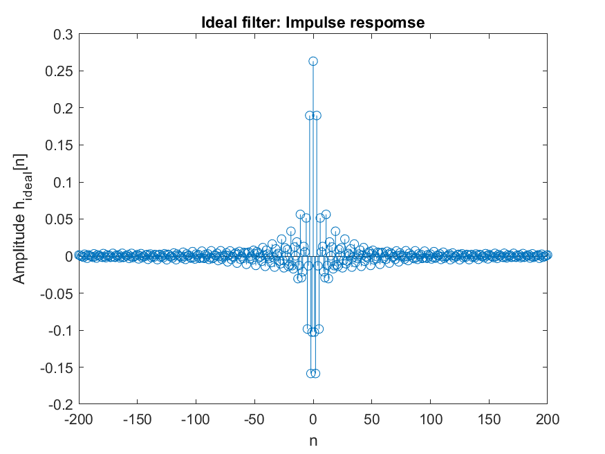
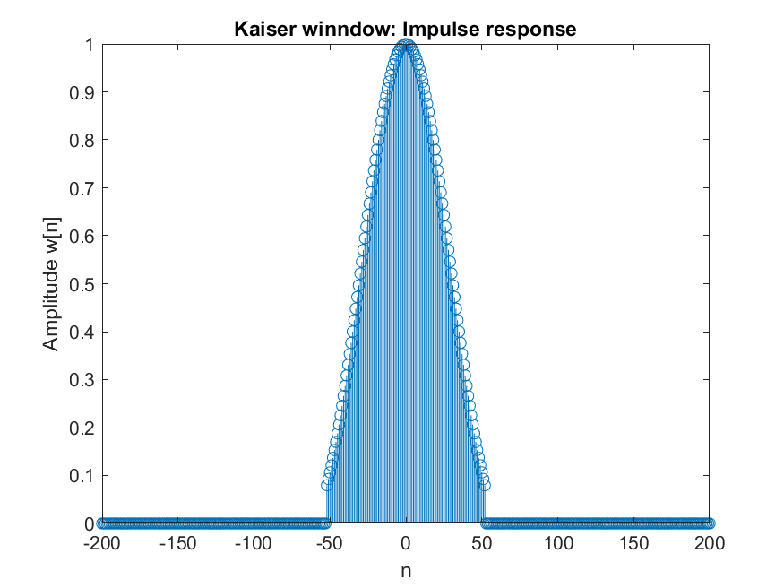
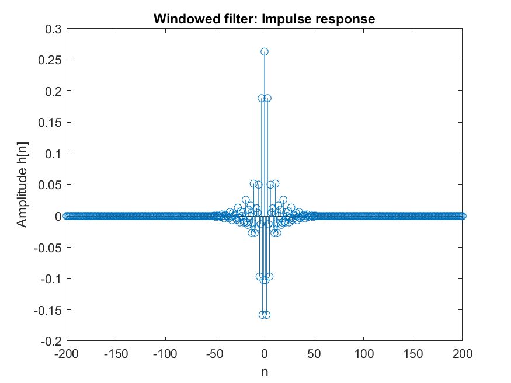
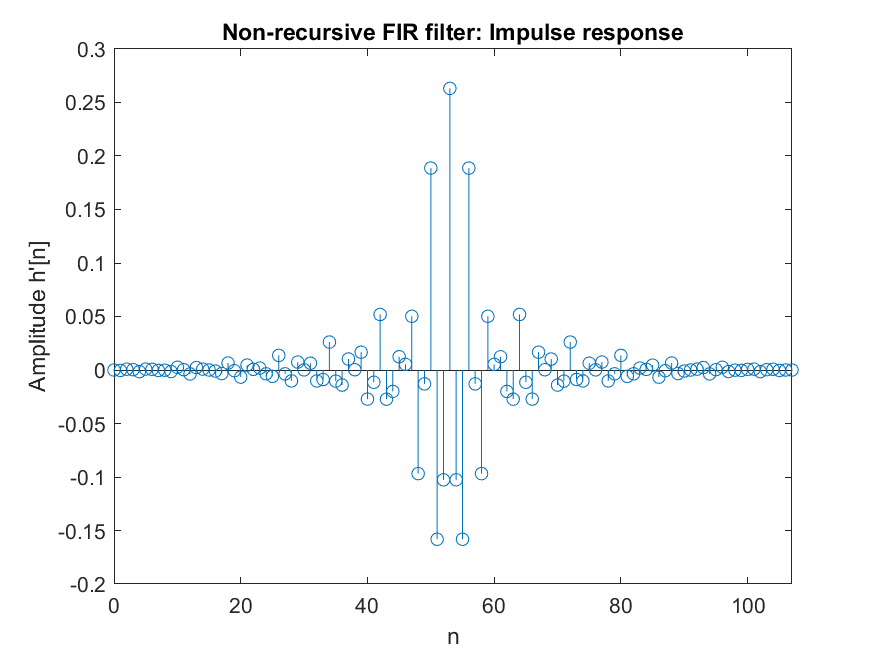
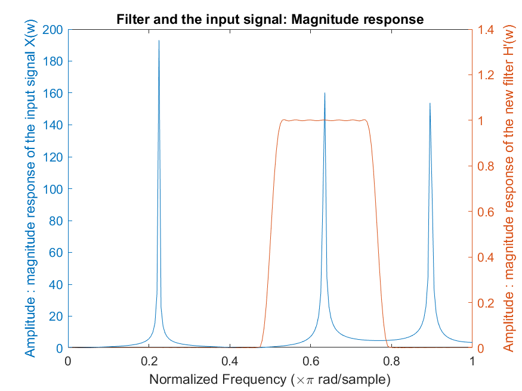
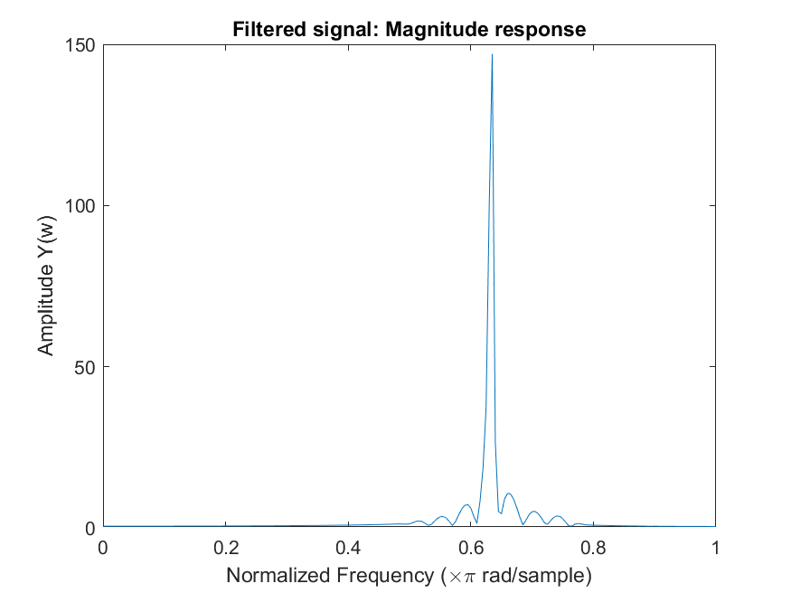

# Design and Simulation of Finite Impulse Response Band-pass Filter Using Kaiser Window

This project contains the `matlab` code for design and simulation of a FIR Band-pass filter using the Kaiser window. You can design simulate your own filter by defining the parameters at the begining of the code accordingly. Please ignore the parameters A, B, and C. You can remove them and change the rest of the parameters at your will. Other parameter variables have their usual meaning in filter design.

After defining the parameters you can run the code and get the graphs of each stage of the design process step by step.

     
